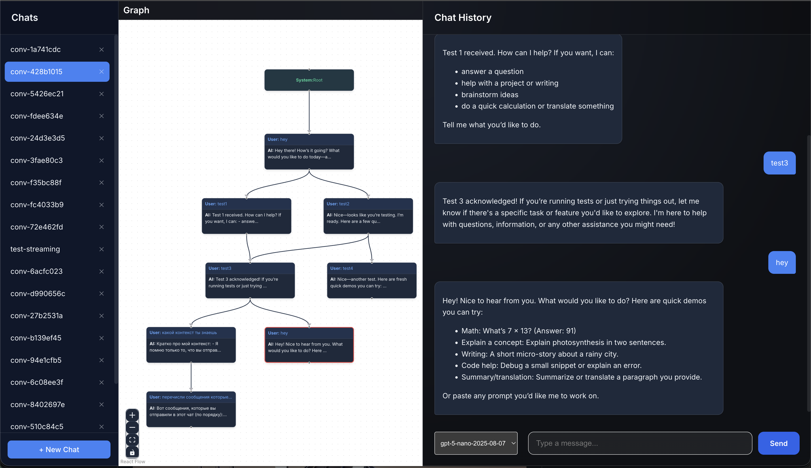

# Forky: Git-style Conversation Management for LLMs


Forky is a conversation management tool that implements git-style branching and merging for LLM interactions. It provides a DAG (Directed Acyclic Graph) structure for conversations, allowing you to fork, explore alternatives, and merge conversation branches with semantic three-way merge.

## Features

### Core
- **Conversation DAG**: Manage conversations as a graph with branching and merging
- **Forking**: Create branches to explore alternative dialogue paths
- **Three-Way Semantic Merge**: Merge branches with LCA computation, state summarization, and conflict detection
- **Multi-Provider Support**: Works with Anthropic (Claude) and OpenAI (GPT) models

### Interface
- **Web UI**: React-based interface with interactive graph visualization
- **CLI**: Command-line interface for terminal-based interaction
- **Real-time Streaming**: Streaming responses from LLMs

### Merge System
- **LCA Computation**: Finds lowest common ancestor for proper three-way merge
- **State Summarization**: Extracts facts, decisions, assumptions from conversation
- **Semantic Diffing**: Computes what changed in each branch
- **Conflict Detection**: Identifies and reports merge conflicts

## Installation

```bash
git clone https://github.com/yourusername/forky.git
cd forky
pip install -r requirements.txt
```

Create `.env` file:
```bash
ANTHROPIC_API_KEY=your_key_here
OPENAI_API_KEY=your_key_here  # optional
```

## Usage

### Web Interface (Recommended)

1. **Start Backend**:
   ```bash
   export PYTHONPATH=$PYTHONPATH:.
   python3 server/app.py
   ```
   Server runs on `http://localhost:8000`

2. **Start Frontend**:
   ```bash
   cd web
   npm install  # first time only
   npm run dev
   ```
   Web app runs on `http://localhost:5173`



**Graph Interactions:**
- Click node → checkout to that point
- Cmd/Ctrl+Click → multi-select nodes
- Select 2 nodes → merge mode (purple input border)

### CLI

```bash
python -m cli.main chat
```

**Commands:**
- `/fork [name]` - Create new branch
- `/merge <branch> [prompt]` - Merge branch with three-way semantic merge
- `/checkout <id|branch>` - Switch to node or branch
- `/status` - View current state
- `/visualize` - ASCII tree visualization
- `/history` - Full conversation history
- `quit` - Exit

## Project Structure

```
forky/
├── core/
│   ├── api_client.py        # LLM API communication (Anthropic/OpenAI)
│   ├── conversation_node.py # Node class with merge metadata
│   ├── conversation_tree.py # Tree/DAG operations, merge logic
│   ├── database.py          # SQLite persistence
│   ├── merge_utils.py       # LCA computation, eligibility checks
│   ├── state_summary.py     # LLM-based state summarization
│   ├── semantic_diff.py     # Semantic diff between states
│   └── merge_executor.py    # Three-way merge execution
├── server/
│   └── app.py               # FastAPI backend
├── web/
│   └── src/
│       ├── App.jsx          # Main React app
│       └── components/
│           └── FlowGraph.jsx # ReactFlow graph visualization
└── cli/
    └── commands/
        └── chat.py          # CLI chat command
```

## API Endpoints

| Endpoint | Method | Description |
|----------|--------|-------------|
| `/conversations` | GET | List all conversations |
| `/conversations` | POST | Create new conversation |
| `/graph` | GET | Get DAG structure for visualization |
| `/history` | GET | Get linear history to current node |
| `/chat` | POST | Send message, get streaming response |
| `/checkout` | POST | Switch to node/branch |
| `/fork` | POST | Create new branch |
| `/check_merge_eligibility` | POST | Check if two nodes can be merged |
| `/merge_branches` | POST | Execute three-way semantic merge |
| `/delete_node` | POST | Delete node (inherits children to parent) |

## Three-Way Merge

When merging two branches, Forky:

1. **Computes LCA** - Finds the lowest common ancestor
2. **Validates** - Blocks ancestor/descendant merges  
3. **Summarizes States** - Extracts structured state for LCA, branch A, branch B
4. **Computes Diffs** - What changed from LCA to each branch
5. **Merges** - Combines changes, detects conflicts
6. **Responds** - LLM generates response with merged context

Conflicts are reported but not auto-resolved - the LLM is informed and may ask for clarification.

## Contributing

Contributions welcome! Please submit a Pull Request.
